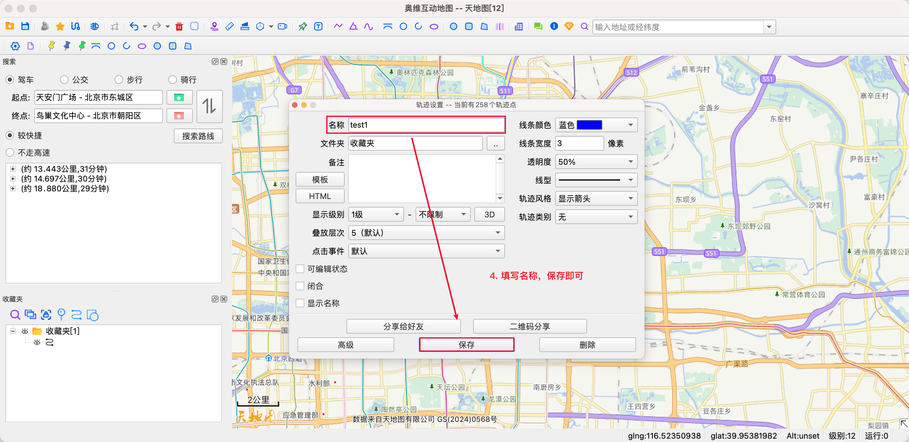

<p align="center">
	<strong>用最快的方式，将三方数据轨迹导入到「一生足迹」中</strong>
</p> 
<h1 align="center">一生足迹数据导入器</h1>


## 1. 项目简介

**一生足迹数据导入器** 是一个便捷的数据转换工具，支持将第三方轨迹数据（如奥维互动地图、KML 等）快速转换为一生足迹 App 所需的 CSV 格式，帮助你更完整地记录旅途与人生的点点滴滴。

## 2. 前言

### 2.1 一生足迹 · 记录一生轨迹

> 你好，
我是足迹的开发者。<br>
2017 年的清明节（17.4.4），我和同事去了一次沙漠，徒步 12 小时，25.7 公里，我们穿越了中国第七大沙漠库布其。
这次旅行很累，也让我记忆深刻。<br>
在回北京的路上有人在群里问，我们是从哪儿走到哪儿的？<br>
可遗憾的是，没有一个人能准确说出。<br>
突然我就感觉挺悲哀的。<br>
也许我的一生也会这样，不管经历多少，遭遇了多少，到最后，都会被淡忘。没有人记得我们的过去。就像我们这次的旅行一样，很快就会被忘记。<br>
所以，我写了这个可以记录一生轨迹的 APP。<br>
—— By 足迹开发者

这是一款专注于个人轨迹记录的 App。多次获得 Apple App Store 推荐，数据完全保存在本地，无服务器、无广告、隐私安全可靠。

虽然一生足迹的开发者在耗电控制与定位漂移优化方面做了大量努力，已经显著提升了使用体验，但在某些极端环境下，仍可能出现记录不完整的问题。

你是否也遇到过这样的场景：
- 高铁出行，信号差
- 飞机出行，轨迹中断
- 沙漠深山中，GPS 不稳定
- 手机电量不足
- ......

为了解决这些特殊场景下的记录缺失问题，「数据导入器」应运而生。

## 3. 核心特性

- ✅ 支持 **奥维互动地图** 的 Omap JSON 格式导入  
- ✅ 支持 **标准 KML 文件格式** 的轨迹导入  
- ✅ 一键转换为一生足迹所需的 CSV 格式  
- ✅ 无需联网，安全可靠  
- ✅ 轨迹合并功能
- 🛠️ 未来将支持「飞常准」等更多格式

## 4. 高级特性

### 4.1 轨迹精度优化

在处理第三方轨迹数据时，程序内置了轨迹补点算法，用于增强轨迹的连贯性与可视效果：

当轨迹中两个相邻点之间的距离超过 100 米 时，程序会自动以 每 100 米 的间隔进行插值补点；

该功能默认启用，适用于如高铁、飞机等定位间断场景；

如不需要补点，可通过启动参数手动关闭。

🔧 关闭轨迹补点示例：

`Mac 平台`

```bash
./main -isInterpolate=false
```

`Windows 平台`

```bash
./main.exe -isInterpolate=false
```

📌 提示：插值点将采用直线插值方式生成，确保轨迹在地图上的视觉连续性，但不会对原始数据精度产生影响。


## 5. 快速开始

### 5.1 下载工具

首先你需要[Releases 页面](https://github.com/hygao1024/steplife-universal-importer/releases)最新版本，然后解压到任意目录。
目录结构示例：

```bash
├── main                // 主程序
└── source_data         // 三方数据存放目录
    ├── kml             // 标准 KML 数据
    ├── ovital          // 奥维互动地图数据
    └── variflight      // 飞常准数据（即将支持）
```


## 6. 数据导入指南

### 6.1 导入奥维互动地图数据

>奥维互动地图，专业地理规划软件
>
>跨平台地图浏览器，支持 iOS (iPhone、iPad)、Android、Windows、macOS、Linux 等流行平台。
>
>拥有强大的设计功能与地理信息展现技术，可满足各行各业地理信息规划的需求。它不仅是您工作上的好帮手，也是您探索未知世界的更好伴侣。

#### 步骤说明：

`Step1.` 你需要下载奥维互动地图应用，下载地址：https://www.ovital.com/download/

`Step2.` 打开奥维互动地图应用，输入起点终点，选择你的路线后并双击，转换成轨迹并保存。具体操作如下图所示




`Step3.` 点击左下角收藏夹，选中你的轨迹进行导出，导出格式请务必选择`Omap json格式`


`Step4.` 导出后的数据放置 `source_data/ovital`，

- `Mac用户`: 在对应目录中打开终端，输入 `./main` 即可。
```bash
./main
```

- `Windows用户`: 在对应目录中打开双击 `main.exe` 或者在终端输入 `./main.exe` 即可。
```bash
./main.exe
```


`Step5.` 程序会生成的`ouput.csv`文件，导入手机中，打开选择选择一生足迹，即可完成数据录入


### 6.2 导入 KML 数据

>KML（Keyhole Markup Language）是一种基于 XML 的文件格式，用于描述地理空间数据。它最初由 Keyhole 公司开发，后被 Google 收购并广泛应用于 Google Earth 等地理信息系统中。KML 文件可以定义点、线、面、模型等地理要素，并支持三维可视化，非常适合用于毕业设计中展示三维立体图。

`Step1.` 你可以从各类地图软件中获取KML数据，再次不做举例

`Step2.` 导出后的数据放置 `source_data/kml`，在对应目录中打开终端，输入 `./main` 即可。

```bash
./main
```

`Step3.` 程序将生成 `output.csv`，可在手机中导入至一生足迹 App。


## 7. 注意事项

- 请确保文件格式正确，命名规范，以便程序正常识别
- 当前版本为命令行工具，后续将考虑支持图形界面
- 如有问题或建议，欢迎提交 [Issue](https://github.com/hygao1024/steplife-universal-importer/issues) 或者 [PR](https://github.com/hygao1024/steplife-universal-importer/pulls)


## 8. 致谢

感谢每一位愿意记录人生、珍视记忆的你。
如果你觉得项目有帮助，请点个 Star ⭐️！仓库地址：https://github.com/hygao1024/steplife-universal-importer
